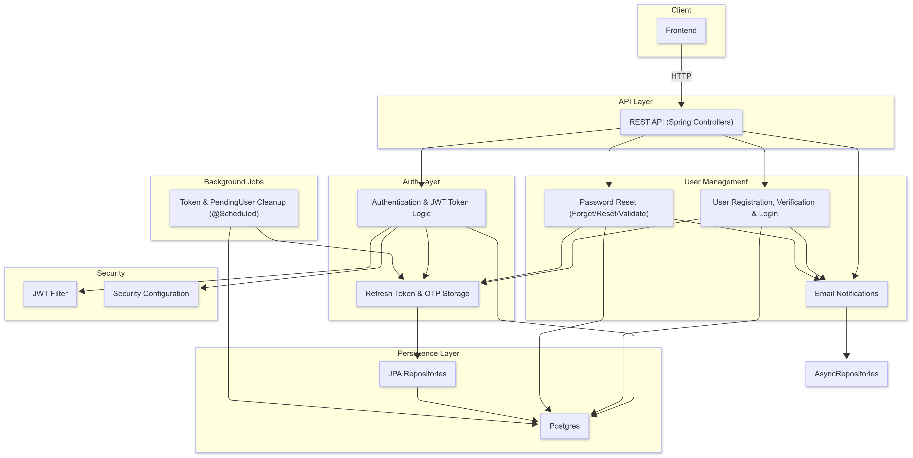
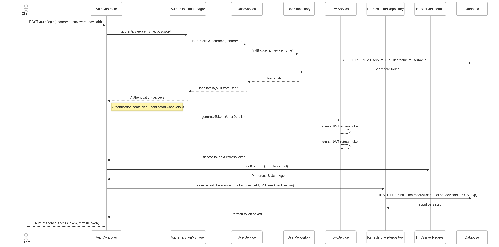

# 🔐 AuthApp

A modern authentication application supporting **token-based authentication** and **email verification via OTP**. Built with:

- ⚙️ **Spring Boot** (Backend)
- 💻 **React** (Frontend)
- 🗄️ **PostgreSQL** (Database)

[](https://github.com/chintakjoshi/authapp/actions/workflows/tests.yml)

---

## 🚀 Prerequisites

Make sure you have the following installed:

| Tool        | Version     |
|-------------|-------------|
| Java        | 21.0.6      |
| Maven       | 3.9.9       |
| NodeJS      | v22.14.0    |
| Docker      | Latest      |

---

## ⚙️ Setup Instructions

### 🔧 Step 1: Configure Environment

1. Rename `.env-sample` to `.env`
2. Insert your credentials into the environment variables.  
   👉 To create credentials, [click here](https://myaccount.google.com/apppasswords)

---

### 🏗️ Step 2: Build and Run

```bash
# Install Spring dependencies (Windows)
./mvnw clean package -DskipTests

# Start containers (Spring Boot, React, PostgreSQL)
docker-compose up --build -d
```

To access the PostgreSQL DB:

```bash
docker exec -it <container_id> psql -U postgres -d authdb
```

---

## 🧠 Architecture Overview

### 🗺️ High-Level Design



---

### 📈 Sequence Diagram



---

## 📫 Contact

For any issues or suggestions, please open an issue on the [GitHub repo](https://github.com/chintakjoshi/authapp).